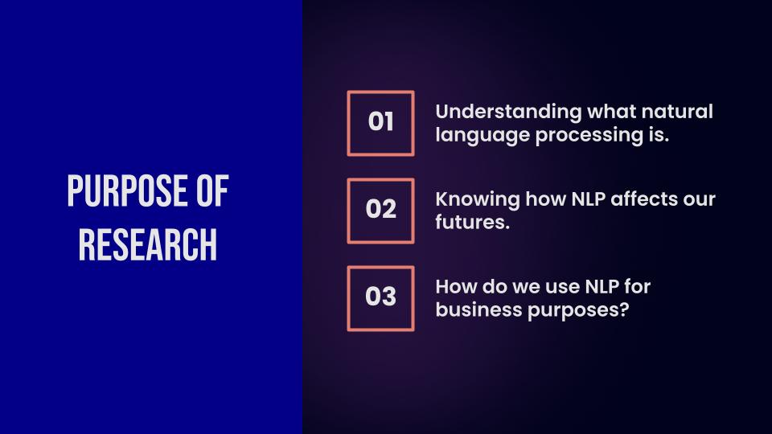
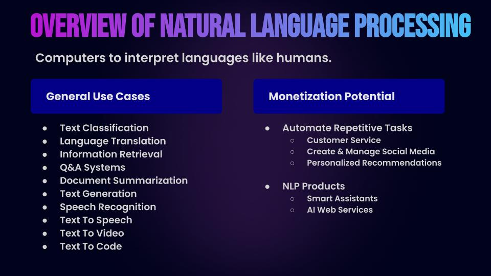
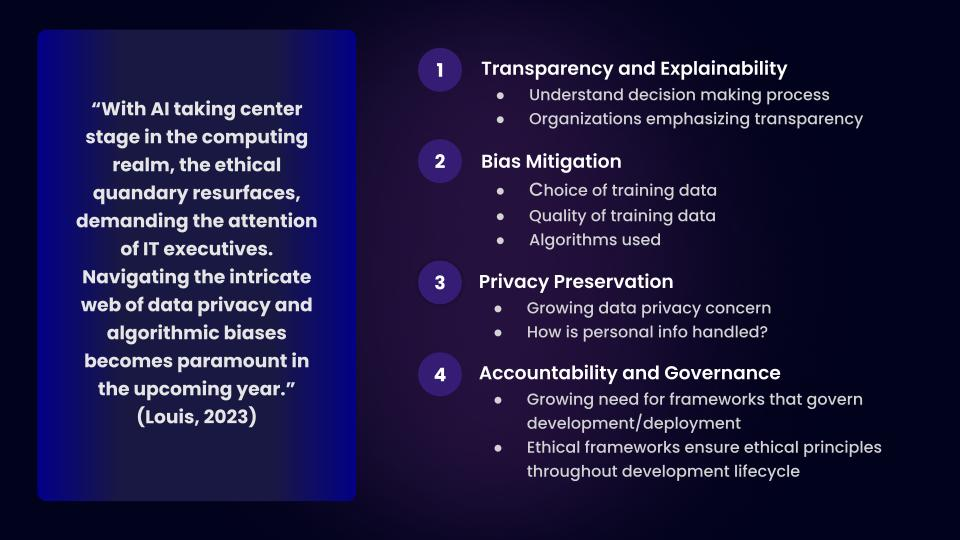
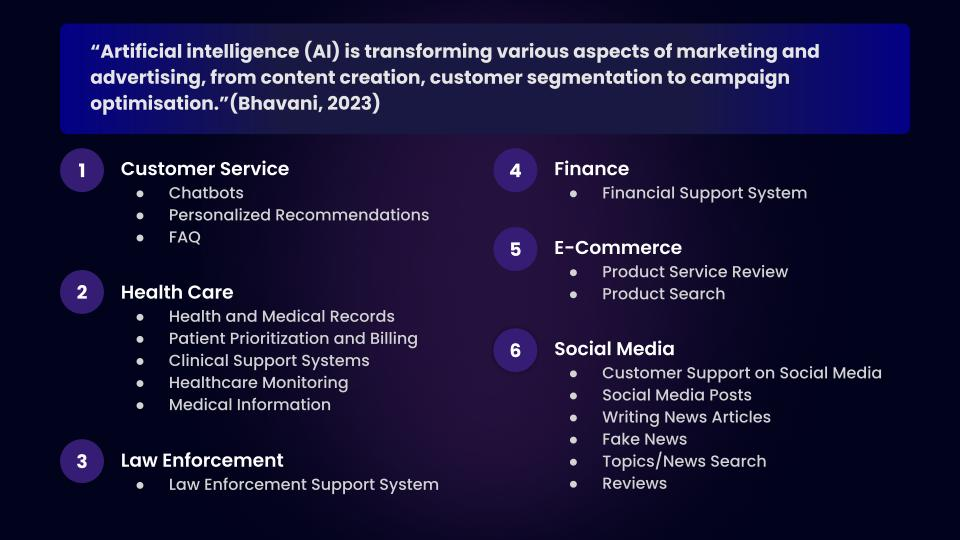
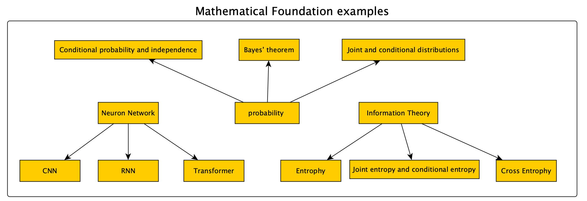
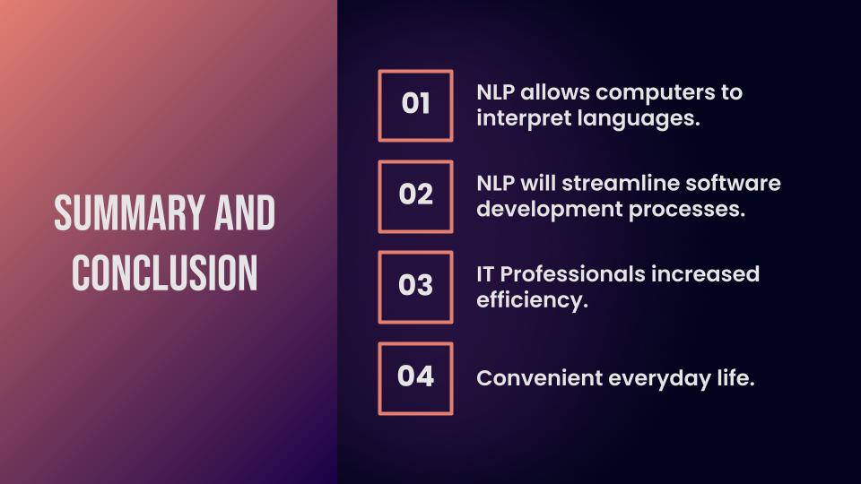

# Natural Language Processing

## Purpose Of Research 


## Overview 


## How Does NLP Affect Future Society?


## Ethical Impact


## Business Potential Of NLP


# Inside NLP with demo

## Math Foundations


## Text Representation
 - Basic Vectorization Approaches
    - One-Hot Encoding
    - Bag of Words
    - Bag of N-Grams 
    - TF-IDF 90
 - Distributed Representations
   - Word Embeddings
Text cannot be processed by computer directly, instead, we encode the word as numbers. e.g. <br>
If the words are ['The', 'quick', 'brown', 'fox', 'jumps', 'over', 'lazy', 'dog'] <br>
There are 8 words in total in the dictionary, using one-hot encoding as an example:
The    -   10000000 <br>
quick  -   01000000 <br>
brown  -   00100000 <br>
fox    -   00010000 <br>
jumps  -   00001000 <br>
over   -   00000100 <br>
lazy   -   00000010 <br>
dog    -   00000001 <br>
With the one-hot encode, each word are represented by a number, that can be processed by computer system. <br>
## Corpus
Text corpus is a dataset, consisting of digitalized language resources either annotated or unannotated
### Example
 { The quick brown fox jumps over the lazy dog }
## Tokenization

['The', 'quick', 'brown', 'fox', 'jumps', 'over', 'the', 'lazy', 'dog']

## n-gram

[('The', 'quick'),
 ('quick', 'brown'),
 ('brown', 'fox'),
 ('fox', 'jumps'),
 ('jumps', 'over'),
 ('over', 'the'),
 ('the', 'lazy'),
 ('lazy', 'dog')]

 ## Conditional Frequency Distributions

 We can use a Conditional Frequency Distribution (CFD) to figure that out! A CFD can tell us: given a condition, what is likelihood of each possible outcome.

This is an example of a CFD with two conditions, displayed in table form. It is counting words appearing in a text collection

Conditional Frequency Distributions example

{'the': {'quick': 2, 'lazy': 1}, 'quick': {'brown': 1}, 'brown': {'fox': 1}, 'fox': {'jumped': 1}, 'jumped': {'over': 1}, 'over': {'the': 1}, 'lazy': {'dog': 1}, 'dog': {'and': 1}, 'and': {'the': 1}}

The CFD shows that the most likely word following word "the" is "quick"

## Context Free Grammar
 ```
  S  -> NP VP
  NP -> Det Nom
  Nom -> Adj Nom | N
  VP -> V NP | V S | V PP 
  PP -> P NP | P PP
  Det -> 'the'| 'The'|'a'
  N -> 'fox' | 'dog' | 'cat' 
  Adj  -> 'quick' | 'lazy' | 'brown'
  V ->  'jumped'|'saw'
  P -> 'over'| 'and' 
```
## NLP Syntax Trees
The parsed syntax trees for a sentence: "The quick brown fox jumped over the lazy dog" 
```

                              S                             
            __________________|__________                    
           |                             VP                 
           |                   __________|___                
           NP                 |              PP             
  _________|____              |      ________|___            
 |             Nom            |     |            NP         
 |     _________|____         |     |     _______|____       
 |    |             Nom       |     |    |           Nom    
 |    |          ____|___     |     |    |        ____|___   
 |    |         |       Nom   |     |    |       |       Nom
 |    |         |        |    |     |    |       |        |  
Det  Adj       Adj       N    V     P   Det     Adj       N 
 |    |         |        |    |     |    |       |        |  
The quick     brown     fox jumped over the     lazy     dog
```
## Demo
- NLP processing <br>
Python nlp.py


# NLP Usage - Chatbot with demo
Bots powered by NLP allow people to communicate with computers in a way that feels natural and human-like — mimicking person-to-person conversations. These clever chatbots have a wide range of application:
- Provide round-the-clock support
- Drive down handling times 
- Free your agents from FAQs
- Offer native-level multilingual customer service, supporting businesses to scale across markets and regions
## Rule based
- Questions and answers are deterministic
- Accurate
- Limited, may not answer
- Most widely used
- Example: Rogers technical support
## AI based
- Probabilistic
- Always answer, but may not be accurate
- Example, ChatGPT

# Demo
- Chatbot <br>
Python chat.py

## Summary And Conclusion
